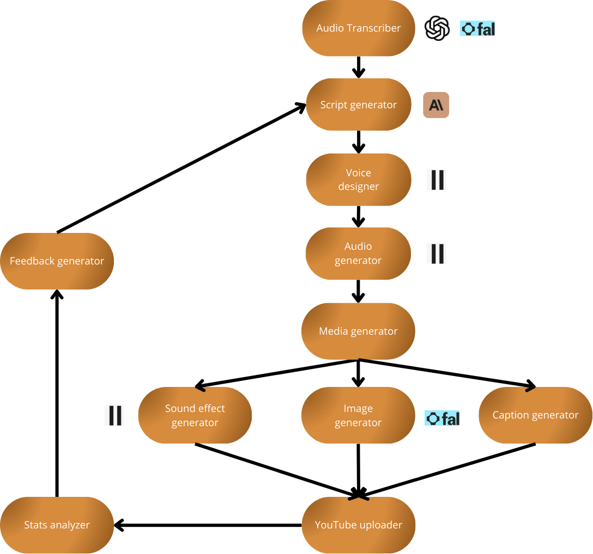

# Clip-Generator-AB-Test

## Structure

The agent operates as a multi-component pipeline for automated content creation and optimization, organized in the following hierarchical structure:



### Core Processing Pipeline

1. **Audio Transcriber**
   - Entry point for audio content processing
   - Converts audio input into processable text

2. **Script Generator**
   - AI-powered component
   - Generates content scripts based on transcribed input
   - Receives optimization feedback from the feedback loop

3. **Voice Designer**
   - Handles voice characteristics and parameters
   - Prepares voice specifications for audio generation

4. **Audio Generator**
   - Converts scripts into spoken audio content
   - Implements voice design specifications

### Media Processing Layer

5. **Media Generator**
   - Central hub for all media asset creation
   - Coordinates three parallel processes:
     - **Sound Effect Generator**: Creates supplementary audio elements
     - **Image Generator**: Produces visual content
     - **Caption Generator**: Generates text overlays and captions

### Distribution and Analytics Layer

6. **YouTube Uploader**
   - Handles content publication
   - Manages upload parameters and scheduling
   - Interfaces with YouTube's platform

7. **Stats Analyzer**
   - Processes performance metrics
   - Tracks engagement and viewer statistics
   - Provides data for optimization

8. **Feedback Generator**
   - Processes analytics data
   - Generates optimization suggestions
   - Creates a feedback loop to the Script Generator for content improvement

### System Integration

- The system implements a continuous feedback loop where performance data influences future content generation
- Parallel processing capabilities in the media generation phase enable efficient resource utilization
- AI integration at the script generation level ensures content adaptability
- Multiple specialized generators ensure comprehensive content packaging

This structure enables automated end-to-end content creation while maintaining quality through data-driven optimization and feedback incorporation.

[You can find our videos here:](docs_media/final_video_with_text.mp4)

## Documentation

[Project's Google Doc](https://docs.google.com/document/d/1bOnIdPGhDHB_Nl-u1p_v7Dn0aMATKQhH4lao0ZH_BjA/edit?tab=t.0)

[Hackathon's Docs](https://docs.google.com/document/d/1fsxiceA97FyWSx8uWC0ulPF6cY7Biusy0dgbcHdMzlk/edit?pli=1&tab=t.0)

[Elevenlabs Documentation](https://docingest.com/docs/elevenlabs.io)

[Fal.ai Documentation](https://docingest.com/docs/docs.fal.ai)

## Environment Management with Pipenv

### Setup Instructions for Collaborative Environment

#### 1. Install Pipenv

First, ensure that you have Pipenv installed on your local machine. If you don’t have it, you can install it via pip:

```bash
pip install pipenv
```

#### 2. Create a Virtual Environment (No need as its already done)

Navigate to your project directory and initialize a new virtual environment using Pipenv:

```bash
cd /path/to/your/project
pipenv install
```

### 2.b. Activate the Virtual Environment

To activate the virtual environment and work within it, use:

```bash
pipenv shell
```

This will create a `Pipfile` in your project directory. This file is used to manage your project's dependencies.

#### 3. Install Project Dependencies

To install the packages your project needs, use the following command:

```bash
pipenv run pip install elevenlabs
```

Replace `<package_name>` with the library or package you want to install (e.g., `numpy`, `pandas`, etc.).

#### 4. Generate `requirements.txt`

If you need a `requirements.txt` file (for example, to share with other environments), you can generate it using:

```bash
pipenv lock -r > requirements.txt
```

This will create a `requirements.txt` file with the exact versions of all your dependencies, ensuring consistency across all environments.

Your command prompt will change to indicate that the virtual environment is now active.

### 7. Deactivate the Virtual Environment

Once you're done working in the virtual environment, you can deactivate it by simply typing:

```bash
exit
```

# Upload videos to youtube

<https://videoflo.app/tutorial/>
